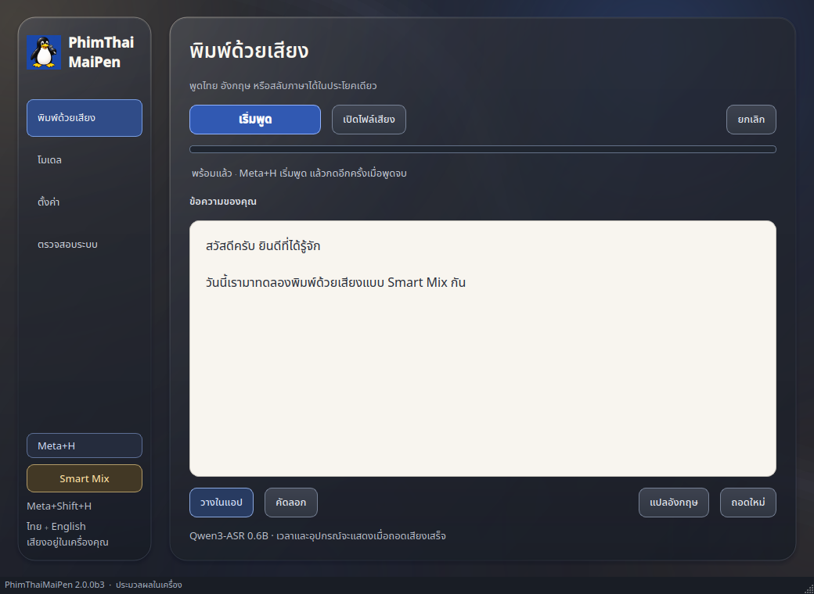

# PhimThaiMaiPen 2.0 · พิมพ์ไทยไม่เป็น


แอปพิมพ์ด้วยเสียงไทย–อังกฤษสำหรับ Linux เลือกโมเดล รับเสียงจากไมค์หรือไฟล์ ตรวจแก้ข้อความ แล้วคัดลอกหรือวางลงแอปอื่น ถอดเสียงและแปลในเครื่องหลังดาวน์โหลดโมเดล

**Local Thai and English voice typing for Linux** — editable transcripts, selectable models, microphone settings, and offline Thai-to-English translation

กำลังเตรียม **2.0.0 beta 3 — รอ CI ตรวจผ่านก่อนเผยแพร่** รุ่นนี้ใช้ไอคอนเพนกวินถือไมโครโฟนที่สร้างใหม่ ไม่มีตัวอักษรในภาพ และหน้าต่างกระจกโทน **น้ำเงินโคบอลต์ / อำพัน / งาช้าง** การติดตั้งใหม่ใช้ **Qwen3-ASR 0.6B + Smart Mix + Auto → CPU + วางทันที** ทดสอบหลักบน **Fedora 44 KDE / Wayland / x86_64** การเร่งด้วย GPU/NPU ยังเป็น Beta และรองรับเป็นรายโมเดลกับอุปกรณ์ ไม่รับรอง Linux ทุกเครื่อง



## ติดตั้ง / Install

### Flatpak · แนะนำสำหรับผู้ใช้ทั่วไป

เมื่อ CI ตรวจผ่านและเผยแพร่แล้ว ดาวน์โหลด `PhimThaiMaiPen-2.0.0-beta.3-x86_64.flatpak` และ `SHA256SUMS` จาก [GitHub Releases](https://github.com/Tatarus9450/PhimThaiMaiPen/releases/tag/v2.0.0-beta.3) แล้วเปิดไฟล์ด้วย **Discover** เพื่อติดตั้ง หรือใช้คำสั่ง:

```bash
sha256sum --check --ignore-missing SHA256SUMS
flatpak install --user ./PhimThaiMaiPen-2.0.0-beta.3-x86_64.flatpak
flatpak run --branch=beta io.github.tatarus9450.PhimThaiMaiPen
```

ต้องมี Flatpak และอินเทอร์เน็ตสำหรับติดตั้ง KDE runtime กับดาวน์โหลดโมเดลครั้งแรก แพ็กเกจรวม Python, Qt, FFmpeg และ PyTorch CPU แล้ว เมื่อเปิดแอปครั้งแรก ระบบเริ่มโหลด **Qwen3-ASR 0.6B ประมาณ 1.89 GB** พร้อมเตรียมปุ่มลัดและขอสิทธิ์วางข้อความจากเดสก์ท็อป หยุดและโหลดต่อได้จากหน้าแอป เปลี่ยนโมเดลได้ภายหลัง

รุ่นนี้เป็น **beta แจกผ่าน GitHub** ยังค้นหาใน Flathub ไม่ได้ การอัปเดตใช้ไฟล์ `.flatpak` รุ่นใหม่ ส่วนโมเดลและการตั้งค่าอยู่ใน `~/.var/app/io.github.tatarus9450.PhimThaiMaiPen/` ผู้ใช้อัปเกรดยังคงการตั้งค่าเดิม ไม่ควรเปิดรุ่น native กับ Flatpak พร้อมกันเพราะใช้ปุ่มลัดชุดเดียวกัน

### Native · สำหรับนักพัฒนา

ต้องมี **Python 3.11–3.13 พร้อม venv**, **FFmpeg**, **patch**, **pactl** และระบบเสียง PulseAudio หรือ PipeWire ที่เปิดบริการ PulseAudio compatibility ติดตั้งแพ็กเกจเหล่านี้จากตัวจัดการแพ็กเกจของ Linux ก่อน ส่วนปุ่มลัดและการวางอัตโนมัติต้องมี `xdg-desktop-portal` พร้อม backend ของเดสก์ท็อป

```bash
git clone https://github.com/Tatarus9450/PhimThaiMaiPen.git
cd PhimThaiMaiPen
python3 scripts/install-app.py
```

จากนั้นเปิด **PhimThaiMaiPen** จากเมนูแอป ตัวติดตั้งเลือก Python ที่รองรับ สร้าง `.venv-app` ติดตั้ง PyTorch รุ่น CPU และเพิ่ม launcher สำหรับผู้ใช้ปัจจุบัน ไม่ใช้ sudo ไม่แก้ Python ของระบบ การดาวน์โหลดโมเดลจะเริ่มเมื่อเปิดแอปครั้งแรก

The installer uses a separate environment and a pinned, checksum-verified Qwen source patch. It installs only Qwen's inference dependencies, validates package requirements and imports, and adds a desktop launcher. Keep the checkout and `.venv-app` in place

```bash
# ระบุ Python เอง / Choose Python explicitly
python3 scripts/install-app.py --python python3.12

# เพิ่ม OpenVINO สำหรับโมเดล Intel / Optional OpenVINO runtime
python3 scripts/install-app.py --intel

# เปิดจาก terminal / Launch directly
.venv-app/bin/python -m phimthai
```

Qwen 0.6B ดาวน์โหลดประมาณ 1.89 GB และใช้ RAM สูงสุดราว 5.3–6 GB ในชุดเสียงทดสอบ ควรเผื่อ RAM ให้เดสก์ท็อปและโปรแกรมอื่นด้วย โมเดลขนาดใหญ่ใช้พื้นที่และ RAM เพิ่ม

## เริ่มใช้ / First run

1. เปิดแอป ระบบเริ่มดาวน์โหลด **Qwen3-ASR 0.6B ประมาณ 1.89 GB** และแสดงความคืบหน้า กด **หยุดดาวน์โหลด** หากยังไม่พร้อม แล้วกด **โหลดโมเดลต่อ** ภายหลังได้
2. ระบบเตรียม `Meta+H` และ `Meta+Shift+H` พร้อมขอสิทธิ์วางข้อความ **ตอบหน้าขอสิทธิ์ของเดสก์ท็อป** แอปแสดงว่าพร้อมเมื่อได้รับผลอนุญาตจริง หากปฏิเสธหรือปุ่มชนกับแอปอื่น ให้แก้ในหน้าตั้งค่า
3. เมื่อโมเดลพร้อม ไปที่ **ตั้งค่า** เลือกไมค์ กด **ทดสอบไมค์ 5 วินาที** และดูระดับเสียง
4. เลือกช่องข้อความปลายทาง กด `Meta+H` พูด แล้วกดอีกครั้งเพื่อหยุด ค่าเริ่มต้นสำหรับการติดตั้งใหม่จะวางทันทีเมื่อถอดเสร็จและมีสิทธิ์วาง Popup เล็กด้านซ้ายแสดง Listening → Thinking → Typing โดยไม่แย่งโฟกัส
5. หากต้องการตรวจแก้ก่อนวาง เปลี่ยน **ตั้งค่า → เมื่อพูดจบ** เป็นโหมดตรวจข้อความ กด **คัดลอก** เพื่อวางเอง หรือ **วางในแอป** ซึ่งให้เวลา 3 วินาทีสลับไปช่องปลายทาง การวางอัตโนมัติขณะแอปอยู่เบื้องหลังหน่วง 250 มิลลิวินาที

ผู้ใช้อัปเกรดยังคงโมเดลและพฤติกรรมการวางเดิม แอปไม่เปลี่ยนเป็นวางทันทีหรือดาวน์โหลดโมเดลที่คุณลบไปใหม่โดยอัตโนมัติ หากยังไม่ได้เปิดสิทธิ์ ใช้ปุ่ม **เปิดใช้ปุ่มลัด / อนุญาตวางข้อความ** ในหน้าตั้งค่าได้

**KDE แบบ native:** ตัวติดตั้งผูก `Meta+H` กับแอปโดยตรง เรียกได้แม้ยังไม่เปิดหน้าต่าง และเลิกใช้ทางลัดของรุ่นเก่าเฉพาะที่แอปเป็นเจ้าของ หากปุ่มชนกับแอปอื่นจะรายงานปัญหาโดยไม่แย่งปุ่ม เปลี่ยนปุ่มใน **ตั้งค่า → เปิดใช้ปุ่มลัด** ได้ แถบด้านซ้ายแสดงปุ่มที่เปิดใช้จริง

**`Meta+Shift+H` สลับโหมด:** Smart Mix → Raw → TH → ENG → Smart Mix ค่าเริ่มต้นคือ Smart Mix กดชื่อโหมดในแถบซ้ายเพื่อสลับได้เช่นกัน แอปจำโหมดที่เลือกและแจ้งชื่อโหมด หากมีงานกำลังทำ โหมดใหม่จะใช้กับการพูดครั้งถัดไป

**เดสก์ท็อปอื่น / Flatpak:** การเริ่มใช้ครั้งแรกขอปุ่มลัดผ่าน portal ของเดสก์ท็อป ผู้ใช้ยังต้องอนุญาตหรือเลือกปุ่มในหน้าต่างของระบบ หากยังไม่พร้อม กด **เปิดใช้ปุ่มลัด** ในหน้าตั้งค่าเพื่อลองใหม่ การรองรับขึ้นอยู่กับ portal

การติดตั้งใหม่เปิด **จำสิทธิ์วางข้อความและปุ่มลัดที่ขอผ่านระบบ** ไว้ เปลี่ยนได้ในหน้าตั้งค่า เดสก์ท็อปเป็นผู้ตัดสินว่าจะจำสิทธิ์ได้หรือขอใหม่เมื่อเปิดแอป ผู้ใช้อัปเกรดยังคงตัวเลือกเดิม ตัวเลือกนี้ไม่จำเป็นสำหรับปุ่มลัด KDE แบบ native

หน้าต่างใช้ Liquid Glass โทนน้ำเงินโคบอลต์ แต้มสีอำพันและงาช้าง ให้เข้ากับไอคอนเพนกวินถือไมโครโฟน แอปกำหนดสีครบ จึงไม่ผสมสีกับธีมมืด/สว่างของระบบ เปิด **ลดความโปร่งใส** ในหน้าตั้งค่าได้ เอฟเฟกต์กระจกวาดจากพื้นหลังภายในแอป ไม่อ่านภาพหน้าต่างอื่น

Popup ระหว่างพูดใช้ขนาด 200×52 และห่างขอบซ้าย 32 พิกเซลตามรุ่นเดิม แสดงโหมด MIX / RAW / TH>ENG และเล่นเสียงเดิมเมื่อส่งวาง เปิด–ปิด Popup และเสียงได้ในหน้าตั้งค่า หน้าต่างหลักยังใช้ Wayland ส่วน Popup ใช้ XWayland/XCB เพื่อกำหนดตำแหน่งและไม่แย่งโฟกัส จึงต้องมี XWayland หากใช้ Wayland

การวางใช้ตำแหน่งปุ่ม Ctrl+V จริง จึงวางได้ทั้งตอนเปิดแป้นไทยและอังกฤษ

| การทำงาน / Action | พฤติกรรม / Behavior |
| --- | --- |
| Open audio | เปิด WAV, MP3, FLAC, OGG หรือ M4A โดยไม่ใช้ไมค์ |
| Cancel | หยุดงานและ process ลูก ยกเลิกการวางที่ยังนับถอยหลัง |
| Retry | ถอดเสียงล่าสุดอีกครั้งด้วยค่าปัจจุบันใน Settings |
| Translate | แปลข้อความใน editor เป็นอังกฤษ ต้องโหลดโมเดล Thai → English แยก |
| Smart Mix / Raw | ปรับข้อความตามกฎและพจนานุกรมส่วนตัว หรือใช้ผลถอดเสียงตรงๆ |
| Clear transcript and temporary audio | ล้างข้อความและเสียงชั่วคราวของ session ปัจจุบัน (`Ctrl+L`) |
| Quit | ออกจากแอปทั้งหมด (`Ctrl+Q`); หากมี system tray การปิดหน้าต่างจะซ่อนไว้ใน tray |

Editor รองรับ Undo การตั้งค่าใหม่ใช้กับงานถัดไป งานที่กำลังทำยังใช้ค่าเดิม แอปปล่อยโมเดลจาก RAM หลังว่าง 5 นาที จึงอาจใช้เวลาโหลดใหม่ในครั้งต่อไป

## โมเดลและอุปกรณ์ / Models and devices

| Model | การใช้งานและผลทดสอบ / Status |
| --- | --- |
| Qwen3-ASR 0.6B | ไทย อังกฤษ และภาษาผสม; CPU ผ่านการทดสอบจริง เป็นค่าเริ่มต้น |
| Qwen3-ASR 1.7B | ตัวเลือกใหญ่ขึ้น ~4.71 GB; ยังไม่ได้ยืนยัน inference บนเครื่องทดสอบนี้ |
| Whisper Tiny / Turbo INT8, OpenVINO | CPU ผ่านแล้ว; Intel GPU/NPU ต้องทดสอบกับฮาร์ดแวร์ที่รองรับ; Tiny แม่นภาษาไทยต่ำในชุดทดสอบ |
| Whisper Turbo Q5, Vulkan | Radeon 840M ผ่านจริง พร้อม CPU สำรองที่ใช้โมเดลเดิม; ต้องติดตั้ง runtime เพิ่ม |
| Whisper Turbo, AMD NPU | Ryzen AI 5 340 ผ่านจริงกับ FastFlowLM ที่แก้ไขแล้ว; ภาษาไทย/ภาษาผสมยังทดลอง ต้องมี driver และ runtime ที่เข้ากันได้ |
| OPUS Thai → English | แปลในเครื่อง แบ่งข้อความยาวเป็นช่วงสั้นเพื่อรักษาเนื้อหา ควรตรวจคำแปลก่อนใช้ |

**Auto ใช้ CPU ใน beta 3** แอปแสดงคำเตือน **GPU / NPU · Beta** สีแดง เพราะยังอยู่ระหว่างพัฒนาและผลอาจไม่แน่นอน แนะนำ CPU สำหรับใช้งานทั่วไป การตรวจพบ `/dev/accel` อย่างเดียวไม่ทำให้ขึ้นสถานะพร้อมถอดเสียง

นำเข้าโมเดลที่มีอยู่แล้วได้จาก **โมเดล → นำเข้าโมเดลจากโฟลเดอร์…** รองรับ **Qwen3-ASR แบบ SafeTensors**, **Whisper OpenVINO** และ **Whisper Turbo GGML Q5** โดยต้องมีไฟล์ครบตามรูปแบบนั้น สำหรับ Qwen/OpenVINO ต้องมี config และ tokenizer ด้วย แอปคัดลอกและตรวจไฟล์เข้าโฟลเดอร์ข้อมูลของตัวเอง เก็บต้นฉบับไว้ แล้วให้เลือกใช้จากรายการโมเดล ไม่รองรับโมเดลทุกชนิด ไฟล์ Qwen แบบ pickle หรือโมเดลที่ต้องรันโค้ดภายนอก การนำเข้าไม่เพิ่ม runtime ที่ขาด เช่น Whisper Turbo GGML Q5 ยังต้องมี whisper.cpp runtime

ตัวติดตั้งมาตรฐานใช้ **CPU PyTorch** หากต้องการ CUDA ให้ติดตั้ง PyTorch ที่ตรงกับระบบของคุณใน `.venv-app` ตาม[เอกสาร PyTorch](https://pytorch.org/get-started/locally/) แล้วเลือก GPU โมเดล Qwen ใช้ CUDA; AMD/Intel GPU ทั่วไปใช้ backend อื่นตามตาราง การรันตัวติดตั้งอีกครั้งจะกลับไปใช้ CPU PyTorch

Vulkan และ AMD NPU เป็นส่วนเสริมสำหรับผู้ทดสอบ runtime ไม่ได้มากับตัวติดตั้งมาตรฐาน ดูไฟล์ recipe/patch ใน [`packaging/`](packaging/) และ [หลักฐานฮาร์ดแวร์](docs/HARDWARE.md) แอปจะแจ้งเมื่อ runtime ขาด และแสดงอุปกรณ์ที่ใช้งานจริงหลังจบงาน

[Compatibility matrix](docs/COMPATIBILITY.md) แยกผลที่ทดสอบแล้วออกจากระบบที่ยังไม่มีหลักฐาน รวมถึง GNOME/X11, Intel NPU และ CUDA

## ข้อมูลและคลิปบอร์ด / Privacy

- ประวัติเสียงและข้อความ **ปิดเป็นค่าเริ่มต้น** และเปิดเก็บแยกกันได้
- เสียงล่าสุดอยู่ในโฟลเดอร์ชั่วคราวส่วนตัวสำหรับ Retry เสียงเก่าจะถูกล้างหลังจบงานหรือเกิดข้อผิดพลาด และล้างทั้งหมดเมื่อออกจากแอปตามปกติ
- **Copy** ตั้งใจเก็บข้อความไว้ในคลิปบอร์ด ส่วน **Paste** คืนข้อมูล MIME เดิมหลังส่งปุ่มวาง หากคุณคัดลอกสิ่งใหม่ระหว่างนั้น แอปจะเก็บสิ่งใหม่ไว้
- แอปส่ง MIME hint ให้ Klipper ไม่เก็บข้อความชั่วคราว ประวัติของ clipboard manager อื่นต้องตรวจแยก
- การดาวน์โหลดโมเดลใช้ revision ที่ตรึงไว้และตรวจ hash ก่อนใช้ ไม่มีการส่งเสียงหรือข้อความไปถอดบนเซิร์ฟเวอร์
- Token สำหรับจำสิทธิ์เดสก์ท็อปเก็บในไฟล์ส่วนตัว และลบเมื่อปิดตัวเลือกแล้วกด Save

Native paths: `~/.config/phimthai/` สำหรับ settings และสิทธิ์เดสก์ท็อป; `~/.local/share/phimthai/` สำหรับโมเดล ประวัติ และ runtime โดยรองรับ `XDG_CONFIG_HOME` / `XDG_DATA_HOME`

## อัปเดตและแก้ปัญหา / Update and troubleshoot

ออกจากแอปด้วย **Quit** ก่อนอัปเดต แล้วรัน:

```bash
git pull --ff-only
python3 scripts/install-app.py
```

โมเดลและข้อมูลผู้ใช้อยู่แยกจากตัวโปรแกรม จึงไม่ต้องโหลดโมเดลใหม่ทุกครั้ง หากย้าย checkout ให้รันตัวติดตั้งใหม่เพื่อแก้ path ของ launcher

| อาการ | วิธีตรวจ |
| --- | --- |
| ไม่มีไมค์หรือไมค์หลุด | ดู Diagnostics และระบบเสียง เลือกไมค์ที่ยังเชื่อมต่อ แล้วลอง Test microphone ใหม่ |
| เปิดหน้าแอปไม่ได้ | ตรวจ Python ที่รองรับและ shared libraries ของ Qt/X11/Wayland จากข้อความผิดพลาดใน terminal |
| ไม่พบคำพูดทั้งที่มีเสียง | ลองปิด VAD ใน Settings และตรวจระดับไมค์ |
| โหลดค้างหรือไฟล์เสีย | กด Cancel download แล้ว Download or repair ต่อได้ |
| วางหรือปุ่มลัดไม่ได้ | หน้าตั้งค่า → เปิดใช้ปุ่มลัด / อนุญาตวางข้อความ; KDE ใช้ปุ่มลัด native ส่วนสิทธิ์วางต้องตอบ portal ใช้คัดลอกได้หาก portal ไม่รองรับ |
| ช้าหรือ RAM ไม่พอ | ใช้ Qwen 0.6B, CPU 6 threads หรือน้อยกว่า และหลีกเลี่ยงโหลดหลายโมเดลพร้อมกัน |

Qt แบบ native มีปัญหาตรวจไมค์หลุดในบางรุ่น แอปจึงใช้ `pactl` ติดตามไมค์ที่เลือก และตรวจซ้ำก่อนส่งเสียงเข้า ASR หากไมค์หายหรือการตรวจล้มเหลว จะยกเลิกการบันทึกชุดนั้น การถอด/เสียบไมค์จริงและการพักเครื่องยังต้องทดสอบเพิ่มตามฮาร์ดแวร์

หากต้องการนำ launcher ออก ให้ลบ `~/.local/share/applications/io.github.tatarus9450.PhimThaiMaiPen.desktop` และ `~/.local/share/phimthai/bin/phimthai` แล้วนำ `.venv-app` ออกเมื่อเลิกใช้ เก็บโฟลเดอร์ข้อมูลไว้ได้ หรือใช้ **Clear history** ใน Settings เพื่อลบประวัติที่เลือกเก็บ

## พัฒนาและทดสอบ / Development

```bash
# หลังใช้ตัวติดตั้ง / After installation
.venv-app/bin/pip install --no-deps --no-build-isolation -e .
QT_QPA_PLATFORM=offscreen .venv-app/bin/python -m unittest discover -s tests -v
# ภาพจากหน้าต่างทดสอบแยก ไม่ใช้ไมค์หรือคลิปบอร์ดจริง
.venv-app/bin/python scripts/check-ui.py --backend wayland
.venv-app/bin/python -m unittest test_asr_backend -v
```

`phimthai/` คือหน้าแอป, worker, ตัวจัดการโมเดลและ backend ส่วน `typhoon_service.py` เป็นแกน ASR ที่ใช้ร่วมกัน โค้ดและ [คู่มือรุ่นเดิม](docs/LEGACY.md) เก็บไว้สำหรับอ้างอิง ตัวติดตั้งใหม่ใช้ `Meta+H` เรียกแอป 2.0 โดยตรง

ผลทดสอบจริงอยู่ใน [บันทึกการพัฒนา](docs/IMPLEMENTATION.md) และ [`docs/evidence/`](docs/evidence/) ชุดเสียง FLEURS 4 ไฟล์ให้ข้อความเท่าเดิมเมื่อเปลี่ยนจาก 12 เป็น 6 threads และลดเวลาประมวลผล 43.9% ผลนี้เป็นเพียงชุดทดสอบเล็กบนเครื่องเดียว ไม่ใช่คำรับรองความเร็วทุกภาษาและทุกเครื่อง

เผยแพร่ซอร์สและ Flatpak beta ผ่าน GitHub เปิดไฟล์ติดตั้งด้วย Discover ได้ แต่ **ยังไม่มีรายการบน Flathub** อ่าน [วิธีสร้างและแจกแพ็กเกจ](docs/DISTRIBUTION.md)

## License

ตัวแอปใช้ [MIT](LICENSE) โมเดลและไลบรารีใช้สิทธิ์ของแต่ละโครงการ ดู [แหล่งที่มาและใบอนุญาต dependency](docs/SOURCE_BUILD_MATRIX.md) ชุดเสียงทดสอบไม่ได้รวมอยู่ใน repository; สคริปต์และผลวัดระบุแหล่งที่มาและ revision ไว้
